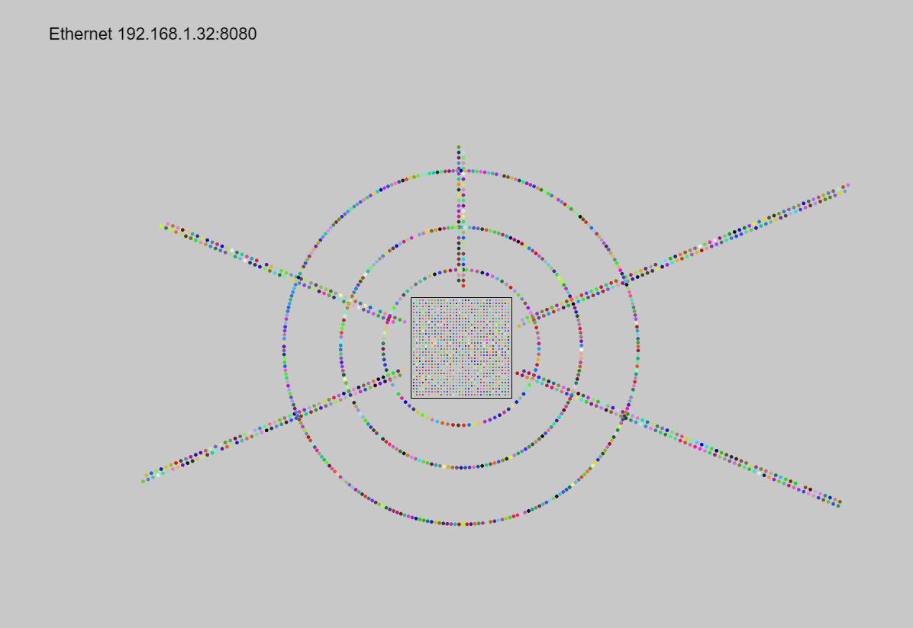
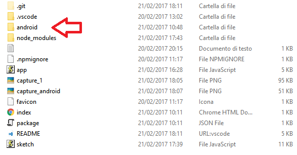
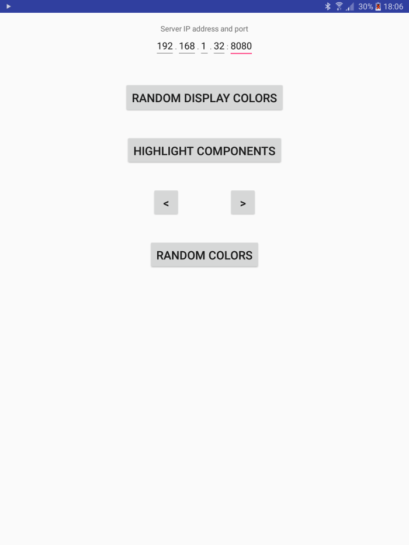
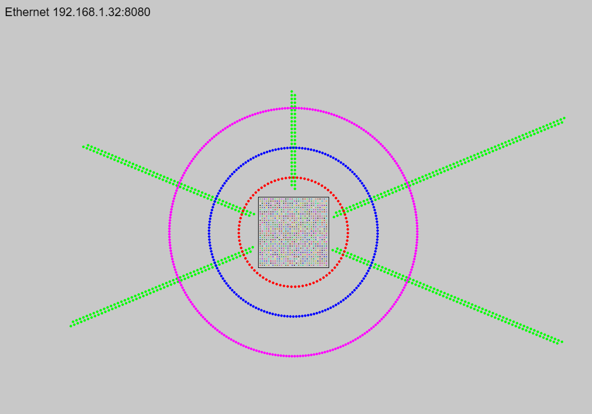
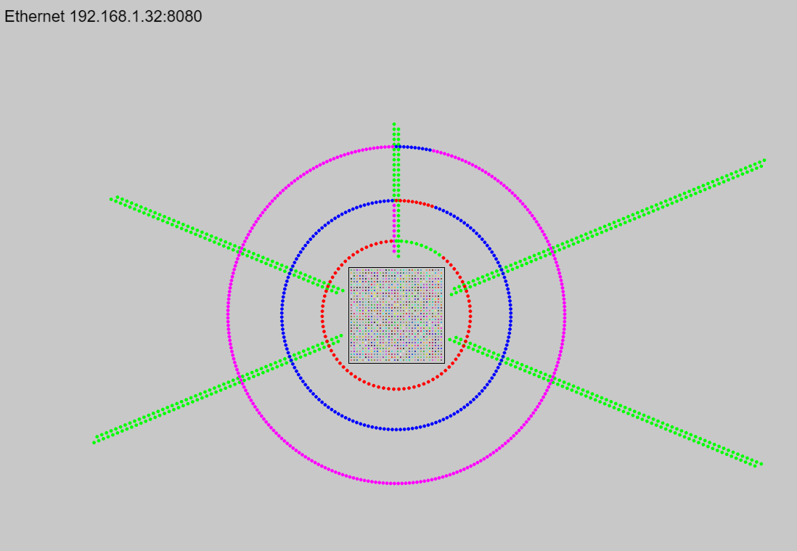

Simulatore della ragnatela
============

Dipendenze:

  * Git
  * Android Studio + JDK
  * NodeJS [sito web](https://nodejs.org/en/)

Dopo avere installato le dipendenze nel sistema si clona il repository https://github.com/j3tm1r/ragnatela_did.git col seguente comando dato da terminale:

    # Let me re-iterate ...
    > git clone https://github.com/j3tm1r/ragnatela_did.git

Il comando crea una nuova cartella che si chiama **ragnatela_did** clonando il reposoitory su Github. Successivamente si eseguono i comandi:
    
    #Entriamo nella cartella appena creata
    > cd ragnatela_did
    #scarichiamo le dipendenze del progetto NodeJS
    > npm install
    #eseguiamo il server node ( lo script app.js in questo caso)
    > npm start
    
Se tutto è andato bene dovremmo vedere un output simile a questo:

    D:\tmp\ragnatela>npm start
    
    > ragnatela_did@1.0.0 start D:\tmp\ragnatela
    > node app.js
    
    Server started on port 8080

A questo punto aprendo nel browser la pagina [http://127.0.0.1:8080](http://127.0.0.1:8080) dovremmo vedere questo:

Avviamo Android Studio e selezioniamo la voce "Open an existing Android Studio project", scegliendo la cartella android che si trova dentro la cartella **ragnatela_did** :

Una volta caricato il progetto da Android Studio lo lanciamo e sullo smartphone si dovrebbe vedere questa interfaccia. 

In alto bisogna specificare l'indirizzo IP e la porta del computer che sta eseguendo il server NodeJS. 
Quest'informazione si può trovare anche nell'interfaccia del simulatore in alto a sinistra. 
**Chi ha Windows deve disabilitare il Firewall o aggiungere un eccezione per la porta 8080.**

La funzione dei 5 pulsanti è descritta di seguito:
    
 * RANDOM_DISPLAY_COLORS : i pixel del display vengono impostati con colori casuali
 * HIGHLIGHT_COMPONENTS : i pixel della ragnatela vengono impostati con colori diversi per i tirante e per gli archi
 * \<  : i pixel vengono "spostati" al contrario di dieci pixel alla volta ( effetto apprezzabile se si impostano prima i colori fissi per i componenti)
 * \>  : i pixel vengono "spostati" in avanti di dieci pixel alla volta
 * RANDOM_COLORS : i pixel della ragnatela vengono impostati con colori casuali
 
Gli esempi di comunicazione col simulatore si trovano nella classe MainActivity.java.  

La seguente immagine mostra il simulatore dopo il comando **HIGHLIGHT_COMPONENTS**

In quest'ultima immagine invece viene mostrato il simulatore dopo la pressione del tasto **\>**

Come si può notare i pixel del primo anello si stanno "spostando" nel secondo e così via..
In bocca al lupo!
 
